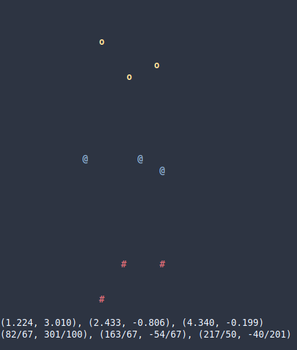

# shapes

Deal with points and triangles.

The goal is not performance, since all numbers are stored as fractions.

It is possible to add a triangle and get the coordinates as human-readable fractions.

Here is an example program:

```go
package main

import (
	"fmt"
	"github.com/xyproto/shapes"
	"math"
	"time"
)

const (
	twoPi = 2.0 * math.Pi

	// ASCII viewport
	fromX = -5
	toX   = 10
	fromY = -4
	toY   = 5

	// Terminal codes
	y  = "\033[1;93mo\033[0m"
	b  = "\033[1;94m@\033[0m"
	r  = "\033[1;31m#\033[0m"
	bg = " "
)

func clear() {
	fmt.Print("\033[H\033[2J")
}

func main() {
	var (
		// The original triangle
		ot = shapes.NewTrianglef(0, 0, 4, 0, 4, 2)

		// The center position of the original triangle
		center = ot.Center()

		// Three triangles
		t1, t2, t3 *shapes.Tri

		// Angle, in radians
		angle = 0.0
	)
	for {
		// Create three new triangles, by rotating ot with different angles
		t1 = ot.RotateAround(angle, center)
		t2 = ot.RotateAround(angle-(math.Pi/3.0), center)
		t3 = ot.RotateAround(angle-(math.Pi/3.0)*2.0, center)

		// Increase the angle just a bit, with wraparound
		angle += 0.07
		if angle >= twoPi {
			angle -= twoPi
		}

		// Clear the terminal
		clear()

		// Draw three triangles, using ASCII graphics
		fmt.Println(t1.Draw(fromX, toX, fromY, toY, y, bg))
		fmt.Println(t2.Draw(fromX, toX, fromY, toY, b, bg))
		fmt.Println(t3.Draw(fromX, toX, fromY, toY, r, bg))

		// Output the coordinates of the third triangle, as floats
		shapes.FloatOutput = true
		fmt.Println(t3.Points())

		// Output the coordinates of the third triangle, as fractions
		shapes.FloatOutput = false
		fmt.Println(t3.Points())

		// Wait a bit
		time.Sleep(10 * time.Millisecond)
	}
}
```

## Screenshot



## General Info

* License: MIT
* Version: 0.0.0
